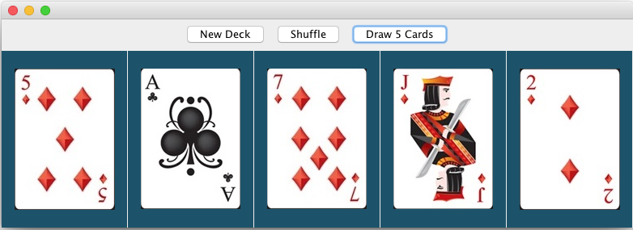

# Java Card Deck
Version 0.0.2: February 17, 2018 by [Karen Freeman-Smith](https://github.com/karenfreemansmith)

## Description
a set of classes that represent a deck of cards, refactored with swing

## Specifications
You should be able to “shuffle” the deck.  You should also be able to draw cards from the deck one at a time until the deck is empty.  Include tests.

* Card class:
  properties
  - suit ( ♣️ ♦️ ♥️ ♠️ )
  - faceValue ( A 1 2 3 4 5 6 7 8 9 10 J Q K )
  - faceUp (boolean)
  - inDeck (boolean)
  methods
  - showCard (to show face)
  - hideCard (to show back)
  - toString
    - returns card face image (filename) if face up
    - returns card back image (filename) if not face up

* Deck class:
  properties
  - collection of cards
    - has 52 cards total
  methods
  - reset
    - deck is ordered
  - shuffle
    - deck not in original order
  - draw
    - countRemaining is -1 from before draw
    - not available if countRemaining is 0
  - countRemaining
    - number of cards left in deck

## Setup/Installation
* Clone directory
* (To run tests only: gradle test)
* Run gradle compileJava
* navigate to build/classes/main
* run program by typing "java App"

## Support & Contact
For questions, concerns, or suggestions please email karenfreemansmith@gmail.com

## Technologies Used
Java, Gradle, junit

## Legal
Copyright (c) 2018 Copyright _Karen Freeman-Smith_ All Rights Reserved.
